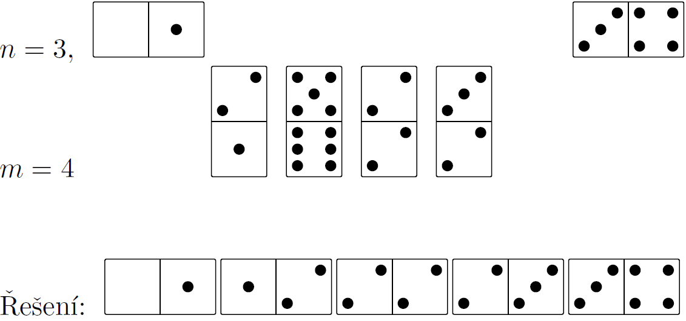
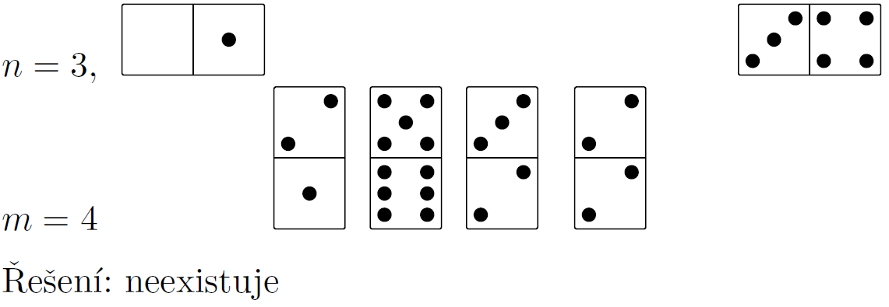
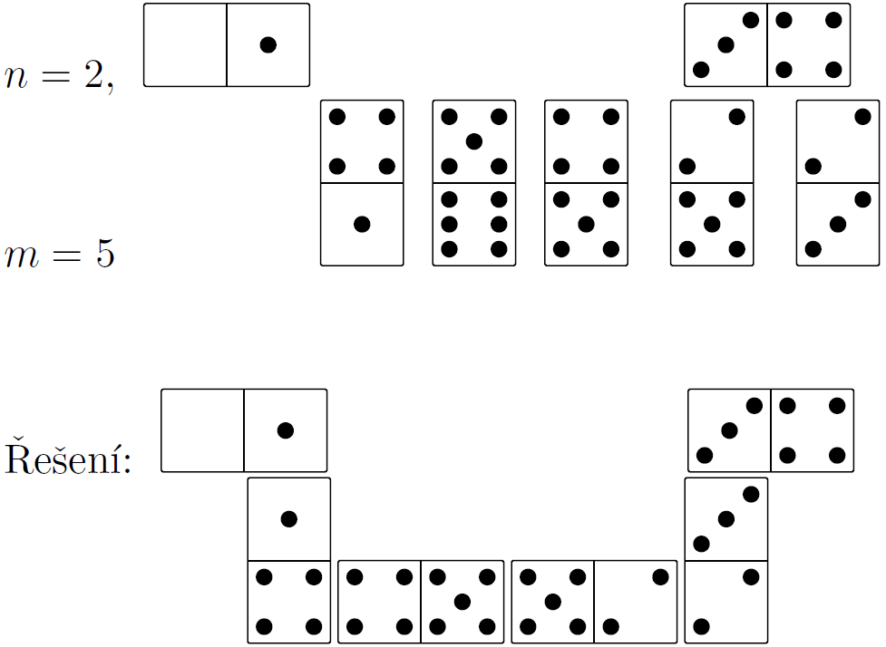

Domino
======
Time limit: 3 s

Po tahanicích s umístěním své sochy potřebuje umělec Černý odpočinek, a tak se rozhodne hrát svou oblíbenou hru – domino, ale ve verzi pro jednoho hráče. Na začátku umístí dvě náhodně vybrané kostky domina do vzdálenosti n kostek od sebe (a to na stejný řádek) a zbylých m kostek (m ≥ n) narovná do řady.

Cílem hry je propojit podle pravidel domina dvě na začátku vybrané kostky pomocí (ne nutně všech) m kostek, které lze ale použít pouze v tom pořadí, jak byly narovnané do řady. Kostky přitom lze otáčet. Pan Černý vyhrává, pokud se mu podaří s těmito pravidly dvě počáteční kostky propojit. V opačném případě prohrál.

Pravidla domina: Každá kostka je rozdělena na 2 poloviny, na každé je určitý počet bodů v rozmezí 0–6. Počet bodů na přikládané kostce musí na přikládané polovině odpovídat počtu bodům na té již položené, kostky se přikládají rovně nebo v pravém úhlu k poslední kostce položené v řadě kostek. Pokud má přikládaná kostka na obou polovinách stejné hodnoty, nesmí být přiložena v pravém úhlu.

Pro zadanou dvojici kostek s hodnotami (a1,b1), (a2,b2), pro jejich zadanou vzdálenost n a pro zadanou posloupnost m kostek (i1,j1), (i2,j2), … , (im,jm) najděte řešení respektující pravidla domina a pořadí zadaných m kostek.

## Vstup

Na vstupu je na prvním řádku číslo K < 10 udávající počet her. Následují jednotlivé hry, které jsou od sebe odděleny prázdným řádkem. Pro jednotlivou hru jsou na vstupu na prvním řádku přirozená čísla n a m oddělená mezerou. Číslo n udává vzdálenost prvních dvou položených kostek od sebe, číslo m < 20 počet zbylých kostek. Na druhém a třetím řádku jsou čísla a1,b1 a a2, b2 oddělená mezerou, udávající počet teček na vybraných dvou kostkách v pořadí 1. kostka na 2. řádku a 2. kostka na 3. řádku. Na dalších m řádcích následují dvojice čísel oddělených mezerou, udávající počet teček na zbylých kostkách. Jejich pořadí je dané pořadím na vstupu.

## Výstup

Pro každou hru vypište na samostatný řádek text „Řešení x: “, kde x je pořadové číslo hry a za dvojtečku vypište pořadí kostek přikládaných do hry zleva doprava ve formátu dvojic v závorkách, kde čísla v závorce jsou oddělena čárkou a závorky jsou odděleny mezerou: (a1,b1) (x1,y1) … (a2,b2). V případě, že řešení neexistuje, vypište text „neexistuje“.

Vzorový vstup
```
4
3 4
0 1
3 4
2 1
5 6
2 2
3 2

3 4
0 1
3 4
2 1
5 6
3 2
2 2

2 5
0 1
3 4
4 1
5 6
4 5
2 5
2 3

2 4
0 1
3 4
1 4
4 4
3 2
5 6
```
Vzorový výstup
```
Řešení 1: (0,1) (1,2) (2,2) (2,3) (3,4)
Řešení 2: neexistuje
Řešení 3: (0,1) (1,4) (4,5) (5,2) (2,3) (3,4)
Řešení 4: neexistuje
```

## Příklad 1

## Příklad 2

## Příklad 3

